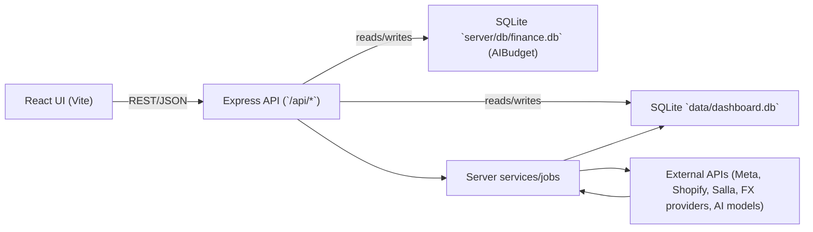

# Repo Notes (Codex)

This file is a lightweight, evolving summary of the repo plus a change log.
I’ll keep it updated after each code change during this session.

## Summary
- Project: Multi-Store Dashboard for VironaX (Salla) and Shawq (Shopify).
- Purpose: Unified analytics + AI tooling for ads performance, attribution, creative intelligence, budget planning, and operational utilities.
- Core flow: Store switcher, date-range controls, Meta hierarchy data, funnel diagnostics, geo/campaign trends, and currency conversion (TRY→USD for Shawq).
- AI/ops tooling: Insight Lab, AI chat (streaming), creative analysis + studio, budget intelligence, product radar, exchange-rate admin, and manual data overrides.
- Demo Mode: Shows realistic demo data without API credentials.

## Architecture
- `client/`: Vite + React frontend.
- `server/`: Express backend (Node ESM).
- Top-level `package.json`: Server scripts (`npm run dev` / `npm start`).
- `client/package.json`: Frontend scripts (`npm run dev`, `build`, `preview`).

## Dependencies (Key)
- Server: `express`, `cors`, `better-sqlite3`, `node-fetch`, `node-cron`, `multer`, `sharp`, `canvas`, `openai`, `@google/generative-ai`, `@anthropic-ai/sdk`.
- Client: `react`, `react-dom`, `recharts`, `lucide-react`, `framer-motion`, `react-markdown`, `remark-gfm`, `vite`, `tailwindcss`.

## Workflow (PRs)
- Default workflow for code changes: create a `codex/*` branch, commit with a clear message, push to `origin`, and open a Pull Request.
- Note: This only works when git remote auth/tools are available in the environment; otherwise I’ll push the branch and tell you what to click to open the PR.
- GitHub CLI (`gh`) note: PR creation via CLI requires a valid `gh auth login` session.

## Repo Tree (Abridged)
- `client/`
- `client/src/`
- `client/src/App.jsx`
- `client/src/components/`
- `client/src/data/`
- `client/src/features/`
- `client/src/utils/`
- `server/`
- `server/server.js`
- `server/routes/`
- `server/services/`
- `server/db/`
- `docs/`

## Pathways
- UI entry: `client/src/main.jsx` → `client/src/App.jsx`
- UI components: `client/src/components/`
- Backend entry: `server/server.js`
- Backend routes: `server/routes/`
- Backend services: `server/services/`

## Tabs & Technical Specs (from `client/src/App.jsx`)
- Dashboard: Core analytics hub with KPIs, funnel diagnostics, geo/campaign trends, time-of-day + day-of-week insights, and Meta breakdowns. Endpoints: `GET /api/analytics/dashboard`, `GET /api/analytics/countries`, `GET /api/analytics/countries/trends`, `GET /api/analytics/campaigns/trends`, `GET /api/analytics/newyork/trends`, `GET /api/analytics/time-of-day`, `GET /api/analytics/days-of-week`, `GET /api/analytics/funnel-diagnostics`, `GET /api/analytics/campaigns/by-*` (including age_gender), `GET /api/analytics/meta-ad-manager`.
- Metrics Charts: Bar charts by campaign/ad/country using `metaAdManagerData` (CTR, CPC, ROAS, CAC, AOV, etc). No direct fetch; uses data already loaded by Dashboard.
- Attribution: Date-ranged attribution dashboard with country drawer and chat assistant. Endpoints: `GET /api/attribution/summary`, `GET /api/attribution/country-series`.
- Insights: “Insight Lab” research feed with signal fusion, radar, narrative brief, budget guidance, and Ask AI explainer. Endpoints: `GET /api/insights`, `POST /api/ai/analyze`.
- Session Intelligence: Live session/event stream with polling, library replay, and AI analysis of sessions/days. Endpoints: `GET /api/session-intelligence/overview`, `/brief`, `/events`, `/sessions`, `/days`, `/sessions-by-day`, `/events-by-day`, `/purchases-by-campaign`; `POST /api/session-intelligence/analyze-session`, `/analyze-day`.
- NeoMeta: Static “Blueprint” + “Control Deck” concept UI for Meta campaign planning. No backend calls.
- Customer Insights: KPI + cohort/retention/bundle/discount sections with charts and insight cards. Data loaded in App via `GET /api/customer-insights`.
- Budget Efficiency: Efficiency status, CAC/spend/ROAS trends, and recommendations. Endpoints: `GET /api/analytics/efficiency`, `GET /api/analytics/efficiency/trends`, `GET /api/analytics/recommendations`.
- Budget Intelligence: Start budget planner + live scale/hold/cut guidance and learning map. Data loaded in App via `GET /api/budget-intelligence`.
- Manual Data: Manual orders + spend overrides + CSV Meta import and bulk delete tools. Endpoints: `GET/POST/DELETE /api/manual`, `GET/POST/DELETE /api/manual/spend`, `POST /api/manual/delete-bulk`, `POST /api/analytics/meta/import`, `DELETE /api/analytics/meta/clear`.
- Fatigue Detector: Creative fatigue & audience saturation diagnostics with statistical tooltips. Endpoint: `GET /api/fatigue`.
- Creative Analysis 🎨 📊: Renders both `CreativeIntelligence` + `CreativeAnalysis`; ad-level creative insights, scripts, and video previews. Endpoints: `GET /api/meta/adaccounts`, `/api/meta/campaigns`, `/api/meta/campaigns/:id/ads`, `/api/meta/ads/:id/video`; `GET/POST/DELETE /api/creative-intelligence/*` (scripts, settings, conversations, analysis).
- Creative Studio ✨: Multi-tool creative workspace (Ad Editor, Video Resizer, Competitor Spy, AI Generate, Analyze, Testimonial Extractor). Endpoints: `GET/POST /api/creative-studio/*` (site summary, generators, video upload/resize, competitor spy, audits, fatigue checks, meta status).
- AI Analytics: Streaming AI chat for analytics with modes (Ask/Analyze/Deep Dive) + reactivation panel. Endpoint: `POST /api/ai/stream`.
- AI Budget: Budget simulator with strategy modes and data health; pulls from budget intelligence + AI budget pipeline. Endpoints: `GET /api/budget-intelligence`, `GET /api/aibudget`.
- Budget Calculator: Two-point scaling calculator with optional AI interpretation. Endpoint: `POST /api/ai/stream` for auto-analysis.
- Exchange Rates: Provider status + backfill + manual rate tools for TRY↔USD. Endpoints: `GET /api/exchange-rates/debug`, `POST /api/exchange-rates/backfill-single`, `POST /api/exchange-rates/manual`.
- Campaign Launcher: Multi-step campaign creation UI with mock pages and simulated launch results (no backend calls).
- Product Radar: Product opportunity scanner + sources health. Endpoints: `GET /api/product-radar/health`, `POST /api/product-radar/scan`.

## Data Flow Diagram

## API Surface (Abridged)
- `GET /api/analytics/*`: Dashboard KPIs, trends, breakdowns, time-of-day, days-of-week, funnel diagnostics, Meta hierarchy.
- `GET/POST/DELETE /api/manual/*`: Manual orders + spend overrides + bulk delete.
- `GET /api/notifications/*`: Notification feed.
- `POST /api/ai/stream`, `POST /api/ai/analyze`: Streaming AI responses and on-demand analysis.
- `GET /api/budget-intelligence`: Budget guidance + priors.
- `GET /api/aibudget`: AIBudget data pipeline.
- `GET /api/whatif/*`: What-if modeling and CSV imports.
- `GET /api/insights`: Insight Lab payloads.
- `GET /api/meta/*`: Meta accounts, campaigns, ads, creatives.
- `GET/POST /api/auth/meta/*`, `GET/POST /api/auth/shopify/*`: OAuth flows.
- `GET /api/attribution/*`: Attribution summary + country series.
- `GET/POST /api/exchange-rates/*`: Debug, backfill, manual rate updates.
- `GET/POST/DELETE /api/creative-intelligence/*`: Scripts, settings, conversations, analysis.
- `GET/POST /api/creative-studio/*`: Studio tools (site summary, generators, video ops, competitor spy, audits, fatigue checks).
- `GET /api/pixels/*`: Pixel diagnostics.
- `GET/POST /api/session-intelligence/*`: Live session streams + analysis.
- `GET/POST /api/product-radar/*`: Health + scan.
- `GET /api/customer-insights`: Customer insights payload.
- `GET /api/fatigue`: Fatigue detector data.
- `GET/POST /api/testimonials/*`: Testimonial extraction.

## Key DB Tables (Abridged)
- Meta performance: `meta_daily_metrics`, `meta_adset_metrics`, `meta_ad_metrics`, `meta_objects`, `meta_backfill_metadata`.
- Orders: `salla_orders`, `shopify_orders`, `shopify_order_items`, `shopify_products_cache`.
- Session intelligence: `shopify_pixel_events`, `si_client_sessions`, `si_shoppers`, `si_events`, `si_sessions`, `si_daily_briefs`.
- Manual overrides: `manual_orders`, `manual_spend_overrides`.
- Exchange rates: `exchange_rates`, `exchange_rate_api_usage`.
- Notifications: `notifications`.
- AI chat: `ai_conversations`, `ai_messages`.
- Creative intelligence: `creative_scripts`, `ai_creative_settings`, `creative_conversations`, `creative_messages`, `creative_funnel_summaries`, `creative_funnel_summary_settings`.
- Creative studio: `studio_creatives`, `studio_templates`, `generated_content`, `creative_fatigue`, `account_audits`, `store_profiles`, `competitor_analyses`.
- Competitor spy: `competitor_ads`, `competitor_brand_cache`, `competitor_swipe_files`, `competitor_saved_ads`, `competitor_tracked_brands`, `user_onboarding`.
- What-if: `whatif_timeseries`, `whatif_sync_log`, `whatif_csv_imports`.
- Auth: `meta_auth_tokens`, `meta_oauth_states`, `shopify_auth_tokens`, `shopify_oauth_states`.
- AIBudget DB (`server/db/finance.db`): `analytics` table (migrated with geo + funnel columns).

## Key Features (from README)
- Store switcher between VironaX and Shawq.
- Dynamic country lists from data.
- Currency conversion for Shawq Meta spend (TRY → USD) with rate caching.
- Campaign names pulled from Meta API.
- Full-funnel metrics (Impressions → Clicks → LPV → ATC → Checkout → Conversions).

## Env Vars (from README)
- VironaX: `VIRONAX_META_AD_ACCOUNT_ID`, `VIRONAX_META_ACCESS_TOKEN`, `VIRONAX_SALLA_ACCESS_TOKEN`
- Shawq: `SHAWQ_META_AD_ACCOUNT_ID`, `SHAWQ_META_ACCESS_TOKEN`, `SHAWQ_SHOPIFY_STORE`, `SHAWQ_SHOPIFY_ACCESS_TOKEN`

## Change Log
- 2026-02-02: Notes file created.
- 2026-02-02: Added tab-by-tab technical specs and endpoints.
- 2026-02-02: Added data flow diagram, API surface, and key DB tables.
- 2026-02-02: Fixed KPI card text overflow/clamping in Customer Insights by adding `line-clamp-*` utilities and tightening KPI typography.
